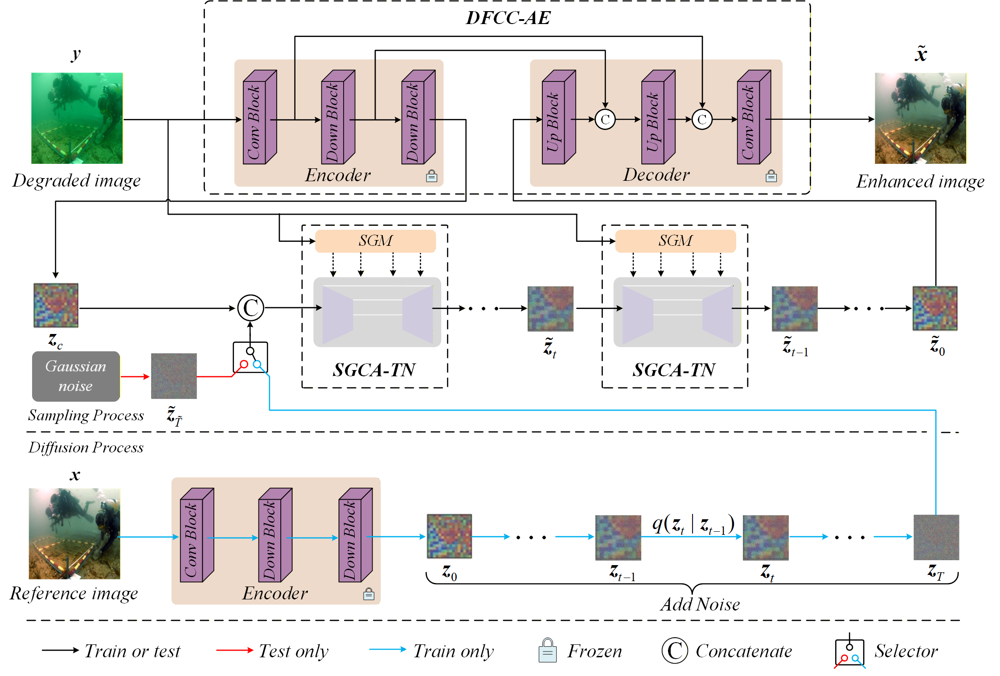

## Dual-flow channel compensation and semantic diffusion guidance for underwater image enhancement



### Getting Started
- Install the relevant packages according to the instructions.
#### Test
- Download the model weights we provide: [DP-LDM](https://pan.baidu.com/s/1nn1THtjRTU1eAybywtzSpw?pwd=b7eb)
- Place vae_UIEBD.pth in the fine_pt/vae folder.
- Place DP-LDM_UIEBD_opt.pth and DP-LDM_UIEBD_gen.pth in the pth folder.
```bash
    python 
```